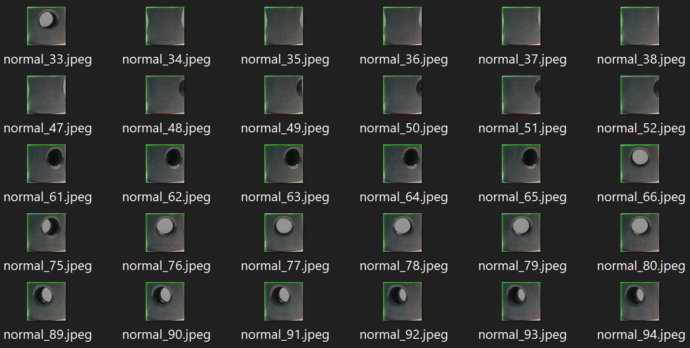

  

# Air Conditioner (AC) Piston Dataset
This dataset1 contains 80x80-pixel images of air conditioner pistons.

The data can be used to build and train an ML model that can detect defects in air conditioner pistons (e.g., during manufacturing).  

# Structure
This repo has the following structure:
* **/data**: contains the images of AC pistons partitioned into the following subdirectories:
  * **/defect_1**: broken, out of shape, or have been dropped.
  * **/defect_2**: have oily, greasy, or rusty stains.
  * **/normal**:  normal, non-defective pistons.

* **/data/defect_log.csv**: CSV file that maps the images to nominal classification values for use in loading the data into PerceptiLabs. "0" corresponds to defect 1, "1" to defect 2, and "2" to normal (i.e., non-defective AC pistons.

The following shows a partial example of the data stored in the CSV file:

| image_path | target |
| ---------- | ------ |
| defect_1/defect_0.jpeg | 0 |
| defect_2/defect2_13.jpeg | 1 |
| normal/normal_5.jpeg | 2 |

# Community

Got questions, feedback, or want to join a community of machine learning practitioners working with exciting tools and projects? Check out our [Community](https://forum.perceptilabs.com/)!

1 Dataset Credits: https://www.kaggle.com/navoneel/brain-mri-images-for-brain-tumor-detection
